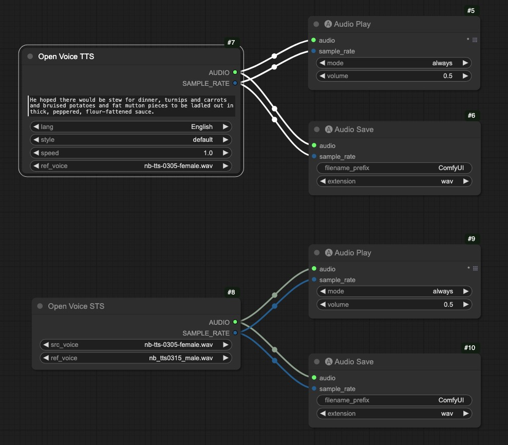

# ComfyUI OpenVoice (Unofficial Support)

Unofficial [OpenVoice](https://github.com/myshell-ai/OpenVoice) support for [ComfyUI](https://github.com/comfyanonymous/ComfyUI).

## Important Updates
- **2024/04/12:** Added ComfyUI nodes and workflow examples

## Basic Workflow
This [workflow](examples/workflow.json) shows the basic usages on (1) text-to-speech (TTS) and (2) speech-to-speech (STS) using reference voice. NOTE: `Chinese` language only supports `default` style.

 

## Installation
- Install from ComfyUI Manager (search for `openvoice`, make sure `ffmpeg` is installed)

- Download or git clone this repository into the ComfyUI/custom_nodes/ directory and run:
```
sudo apt install ffmpeg
pip install -r requirements.txt
```

## Download Checkpoints
All the models are downloaded automatically, no worries.